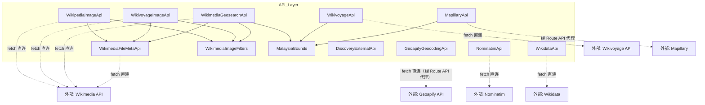
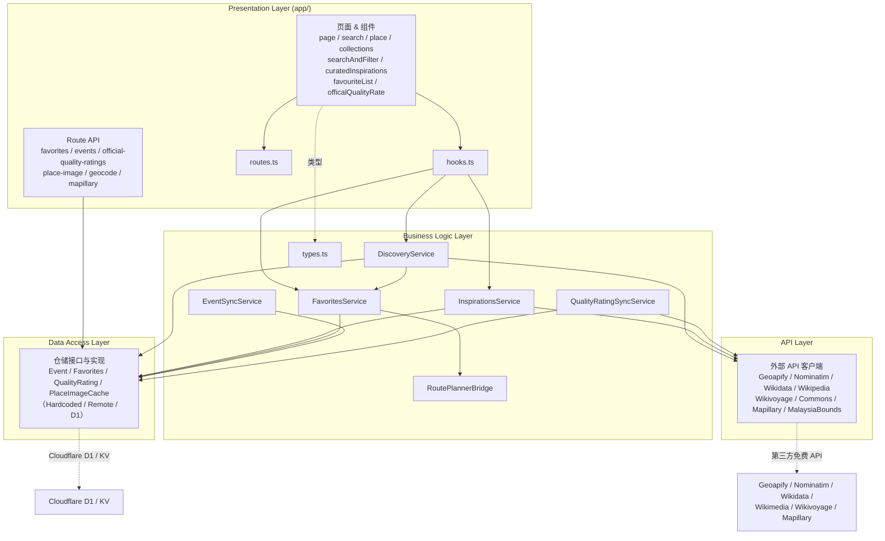

```mermaid
graph TD
    subgraph 布局与页面
        layout["layout.tsx 模块布局（全局收藏夹浮层）"]
        page["page.tsx 主页"]
        search_page["search/page.tsx"]
        place_page["place/[placeId]/page.tsx"]
        collections_page["collections/[collectionId]/page.tsx"]
    end
    subgraph 组件
        searchAndFilter["searchAndFilter.tsx"]
        curated["curatedInspirations.tsx"]
        favourite["favouriteList.tsx"]
        officialRate["officalQualityRate.tsx"]
        attribution["placeImageAttribution.tsx"]
    end
    subgraph 数据与工具
        hooks["hooks.ts"]
        routes["routes.ts"]
    end
    subgraph Route API
        fav_route["api/favourites/route.ts"]
        geo_route["api/geocode/route.ts"]
        evt_route["api/events/route.ts"]
        rate_route["api/official-quality-ratings/route.ts"]
        img_route["api/place-image/route.ts"]
        map_route["api/mapillary/route.ts"]
    end

    layout --> favourite
    page --> searchAndFilter & officialRate
    page --> hooks & routes
    search_page --> searchAndFilter
    search_page --> hooks & routes
    place_page --> attribution
    place_page --> hooks & routes
    collections_page --> hooks & routes
    searchAndFilter --> routes
    curated --> hooks & routes
    favourite --> hooks & routes
    officialRate --> hooks & routes & attribution
    attribution -.->|类型| types["BL: types.ts"]
    page -.->|StarIcon| favourite
    search_page -.->|StarIcon| favourite
    place_page -.->|StarIcon| favourite

    fav_route --> data_D1Fav["DataAccess: D1FavoritesRepository"]
    evt_route --> data_D1Evt["DataAccess: D1EventRepository"]
    rate_route --> data_D1Rate["DataAccess: D1QualityRatingRepository"]
    img_route --> data_KV["DataAccess: PlaceImageCacheRepository"]
    geo_route -->|直接代理| geoapify["外部: Geoapify API"]
    map_route -->|直接代理| mapillary["外部: Mapillary API"]
    map_route --> api_bounds["APILayer: MalaysiaBounds"]

    hooks --> bl_disc["BL: DiscoveryService"]
    hooks --> bl_fav["BL: FavoritesService"]
    hooks --> bl_insp["BL: InspirationsService"]
```

```mermaid
graph TD
    subgraph BL
        disc["DiscoveryService"]
        insp["InspirationsService"]
        fav["FavoritesService"]
        evt["EventSyncService"]
        rate["QualityRatingSyncService"]
        bridge["RoutePlannerBridge"]
        types["types.ts"]
    end
    subgraph API_Layer
        geo["GeoapifyGeocodingApi"]
        wd["WikidataApi"]
        wiki_img["WikipediaImageApi"]
        wv_img["WikivoyageImageApi"]
        gs["WikimediaGeosearchApi"]
        mply["MapillaryApi"]
        bounds["MalaysiaBounds"]
        fmeta["WikimediaFileMetaApi"]
        ext["DiscoveryExternalApi"]
        nom["NominatimApi"]
        wv["WikivoyageApi"]
    end
    subgraph Data_Access_Layer
        fav_repo["FavoritesRepository"]
        qr_repo["OfficialQualityRatingRepository"]
        evt_repo["EventRepository"]
        img_repo["PlaceImageCacheRepository"]
        r_qr["RemoteQualityRatingRepository"]
        r_evt["RemoteEventRepository"]
        r_img["RemotePlaceImageCacheRepository"]
        h_qr["HardcodedQualityRatingRepository"]
        h_evt["HardcodedEventRepository"]
    end

    disc --> geo & wd & wiki_img & wv_img & gs & mply & bounds & ext
    disc --> fmeta & fav_repo & qr_repo & evt_repo & img_repo
    disc --> r_qr & r_evt & r_img
    disc --> fav
    insp --> wv & bounds
    fav --> fav_repo & bridge
    evt --> h_evt & r_evt
    rate --> nom & h_qr & r_qr
    types --> fav_repo & qr_repo & img_repo & geo
```

# 模块 03 — Destination Discovery & Inspiration 代码文档总目录

> 本文档覆盖模块 03 在四个 Layer 下的全部代码文件，包括每个文件的职责、函数明细与依赖关系。
> 各文件详细文档见对应 Layer 文件夹。

## 模块概览

模块 03（目的地探索与灵感）是 TravelSync 的**目的地发现**模块：用户可搜索马来西亚地点（Geoapify 地理编码，强制限定马来西亚）、按体验类型/州属/室内外场景多维筛选、查看官方品质评级（Recommended Places）、浏览灵感合辑（Wikivoyage 主题自动发现）、节日活动流、收藏地点并加入行程（模块 02），所有地点图片走统一的 Wikimedia/Mapillary 图片链路（带开源协议署名与三级缓存）。

**分层职责**（遵循 AGENTS.md）：

| Layer | 目录 | 职责 |
| --- | --- | --- |
| Presentation Layer | `app/` | UI 组件、页面、数据 hooks、Route API（服务端薄代理，注入密钥与白名单校验） |
| Business Logic Layer | `business_logic_layer/03_Destination_Discovery_&_Inspiration/` | 业务编排、领域类型、聚合/筛选/缓存策略（浏览器端执行） |
| Data Access Layer | `data_access_layer/03_Destination_Discovery_&_Inspiration/` | 数据存取：接口 + 硬编码 JSON / 远程（Route API）/ D1 / KV 实现 |
| API Layer | `api_layer/03_Destination_Discovery_&_Inspiration/` | 与外部第三方 API（Geoapify/Nominatim/Wikidata/Wikimedia/Mapillary/Wikivoyage）沟通 |

**依赖方向（严格单向）**：Presentation → Business Logic → Data Access / API。

---

## 一、Presentation Layer（`app/`）

> 详细文档目录：`Presentation_Layer/`（页面/组件）与 `Presentation_Layer/api_routes/`（Route API）

### 代码文件清单与介绍

| 代码文件 | 类型 | 一句话定位 |
| --- | --- | --- |
| `layout.tsx`（模块 03 布局） | 布局组件 | Module 03 路由段共享壳：全局挂载收藏夹浮层（悬浮按钮+抽屉），跨页面可用 |
| `page.tsx`（模块 03 主页） | 页面组件 | 模块 03 首页：搜索筛选 + 灵感合辑 + 官方评级三大区块的布局与编排（收藏夹浮层由布局提供） |
| `search/page.tsx` | 页面组件 | 搜索结果页：Geoapify 真实搜索结果 + 多维筛选 + 地点卡片与收藏 |
| `place/[placeId]/page.tsx` | 页面组件 | 地点详情页：详情 + 图片 + 收藏（星标与文字按钮） + 附近灵感 |
| `collections/[collectionId]/page.tsx` | 页面组件 | 灵感合辑详情页：合辑成员列表 + 附近灵感 |
| `hooks.ts` | 数据 hooks | 模块 03 数据 hooks 集合：封装对 BL 层服务的异步调用与本地交互状态（含收藏变更事件广播） |
| `routes.ts` | 路径常量 | 模块 03 各页面路由路径与链接构造函数 |
| `searchAndFilter.tsx` | 客户端组件 | 搜索框 + 多维筛选面板（体验类型/州属/场景标签页） |
| `curatedInspirations.tsx` | 客户端组件 | 灵感合辑卡片列表（含 "Generate more"） |
| `favouriteList.tsx` | 客户端组件 | 收藏夹组件（悬浮按钮 + 抽屉 + 背景遮罩）：含加入行程、移除、详情跳转、点击遮罩关闭 |
| `officalQualityRate.tsx` | 客户端组件 | Recommended Places 官方品质评级卡片列表 |
| `placeImageAttribution.tsx` | 客户端组件 | 图片署名条（开源协议展示合规） |
| `safeUrl.ts` | 工具 | 外部 URL 协议白名单过滤（防存储型 XSS，安全审计修复） |
| `api/favourites/route.ts` | Route API | 收藏 CRUD 代理：浏览器端经此读写 D1（userId 由服务端会话解析） |
| `api/geocode/route.ts` | Route API | Geoapify 代理：服务端注入 API key + 强制马来西亚 |
| `api/events/route.ts` | Route API | 活动 CRUD 代理：浏览器端经此读写 D1 events |
| `api/official-quality-ratings/route.ts` | Route API | 官方评级 CRUD 代理：浏览器端经此读写 D1 |
| `api/place-image/route.ts` | Route API | 地点图片 KV 缓存代理：浏览器端经此读写 Cloudflare KV |
| `api/mapillary/route.ts` | Route API | Mapillary 代理：服务端注入 access token + 强制马来西亚 bbox |

### 文件介绍

- **`layout.tsx`（模块 03 布局）** — Module 03 路由段（`/03_Destination_Discovery_&_Inspiration/**`）共享布局壳：持有抽屉开关 `isDrawerOpen` 并**全局挂载收藏夹浮层**（`FavouriteList`：悬浮按钮 + 抽屉 + 背景遮罩），主页 / 搜索结果页 / 地点详情页 / 合辑详情页任一页面都可随时打开收藏夹（路由切换时抽屉状态保持）；收藏数据一致性由 hooks 事件广播保证（见 `hooks.ts`）。
- **`page.tsx`（模块 03 主页）** — 模块 03 首页布局与编排：组合搜索筛选面板（`SearchAndFilter`）、灵感合辑区（`CuratedInspirations`，含节日活动流）与官方品质评级区（`officalQualityRate`），数据全部经 `hooks.ts` 从 BL 层服务获取；搜索框为空时展示 Recommended Places 官方评级（与搜索栏解绑），输入关键词后切换为实时搜索结果跳转提示。收藏夹浮层不在本页挂载（由布局 `layout.tsx` 全局提供）。
- **`search/page.tsx`** — 搜索结果页：从 URL 参数恢复筛选初始状态，经 `discoveryService.searchPlaceDetails` 获取 Geoapify 真实搜索结果（带品质徽章合并与"名称+地址"去重），支持多维筛选（场景/体验类型/州属）、收藏切换、图片懒加载（`usePlaceImages` 分批并发保护免费配额）与地点详情跳转。
- **`place/[placeId]/page.tsx`** — 地点详情页：按 placeId 与搜索词经 `discoveryService.getPlaceDetail` 加载详情（官方评级地点 D1 直查 + 其余搜索兜底），展示地址/分类/评分徽章等字段、地点图片（含署名条）、收藏操作（图片角落星标 + 详情区**文字按钮**「Add to Favourites / Remove from Favourites」）与"加入行程"操作，以及经 `useNearbyInspirations` 的附近灵感推荐。
- **`collections/[collectionId]/page.tsx`** — 灵感合辑详情页：经 `useCollectionDetail` 加载合辑成员列表（Wikivoyage 文章聚合，含导语/缩略图/Star 徽章/外链），成员带坐标时经 `useNearbyInspirations` 展示附近灵感区，路由切换期间展示加载过渡态。
- **`hooks.ts`** — 模块 03 Presentation 数据 hooks 中枢（8 个导出）：`useSearchAndFilter`（搜索/筛选/联想防抖 300ms/收藏切换）、`useCollections`（合辑列表 + sessionStorage 状态恢复 + Generate more）、`useCollectionDetail`、`useNearbyInspirations`、`useEventFeed`、`useFavorites`（收藏列表 + 体验类型过滤 + 加入行程；**写操作成功后广播 `module03:favourites-changed` 事件，所有 useFavorites 实例监听并自动刷新**，保证 Recommended Places / 搜索结果 / 地点详情 / 收藏夹抽屉跨实例即时一致）、`usePlaceImages`（按 `IMAGE_FETCH_CONCURRENCY = 4` 分批取图）、`SearchAndFilterInitial` 等；全部带 `cancelled` 防竞态与静默降级，是 UI 与 BL 层之间的唯一数据通道。
- **`routes.ts`** — 模块 03 路由路径常量与链接构造函数：`MODULE_03_HOME`、`SEARCH_PAGE`、`searchPagePath`（携带筛选参数）、`placeDetailPath`、`collectionDetailPath`、`WIKIVOYAGE_HOME`（外部指南外链）与 `googleMapsUrl`（官方评级地点地图外链），供各页面/组件统一生成导航链接。
- **`searchAndFilter.tsx`** — 搜索与多维筛选面板（受控组件）：搜索框（输入联想下拉）、场景标签页（室内/室外/全部，`activeType`）、体验类型与马来西亚州属下拉筛选，交互状态由 `useSearchAndFilter` 提供；主页与搜索结果页复用。
- **`curatedInspirations.tsx`** — 灵感合辑与节日活动区域：合辑卡片列表（封面/标题/副标题/成员数与 Star 数徽章）+"Generate more"（达到 `MAX_COLLECTIONS_DISPLAYED` 后切换为 Wikivoyage 外链按钮），下方展示节日活动流卡片（标题/分类/日期/地点/官方外链）；空态与降级文案齐全。
- **`favouriteList.tsx`** — 收藏夹组件（由 Module 03 布局 `layout.tsx` 全局挂载，模块内任意页面可用）：悬浮按钮（含实时计数）+ 右侧抽屉。抽屉展示收藏条目（缩略图/名称/体验类型）、按体验类型过滤（状态组件内部自管）、移除收藏、跳转详情与"加入行程"（经 `favoritesService.addToTrip` 桥接模块 02）；**打开时渲染背景遮罩（`bg-gray-900/40 backdrop-blur-sm`），点击列表以外区域（遮罩）自动关闭**；收藏变更经 hooks 事件广播自动刷新列表与计数。同时导出 `StarIcon` 星星图标供其他组件复用收藏标记。
- **`officalQualityRate.tsx`** — Recommended Places 兴趣点决策视图：展示官方品质评级地点卡片（公司名/地址/电话/品质徽章/评级有效期/图片），数据来自 `discoveryService.getQualityRatedPois`（D1），卡片图片走统一图片链路 `usePlaceImages`，提供 Google Maps 外链与详情跳转。
- **`placeImageAttribution.tsx`** — 图片署名展示组件：按图片结果渲染作者/许可信息条（如 "CC BY-SA 4.0" 与许可链接），确保开源协议署名合规；无署名信息时不渲染。
- **`api/favourites/route.ts`** — 收藏 Route API：GET（列当前登录用户收藏，未登录返回空列表）/ POST（添加）/ DELETE（按 id 删除），当前用户 ID 一律由服务端会话（`Authorization: Bearer <token>`）解析、不再信任前端参数，服务端以 D1 binding + 会话 userId 实例化 `D1FavoritesRepository` 完成持久化，是浏览器端 `RemoteFavoritesRepository` 的传输通道（统一路径见 guideline §5）。
- **`api/geocode/route.ts`** — Geoapify 代理 Route API：白名单校验参数（type/text/limit），服务端注入 `GEOAPIFY_API_KEY`（非 NEXT_PUBLIC，密钥不进前端 bundle），强制 `filter=countrycode:my`（前端无法绕过），转发 api.geoapify.com 并透传 GeoJSON，解析仍由 API Layer 客户端完成（薄传输）。
- **`api/events/route.ts`** — 活动 Route API：GET（全部活动，公开读）/ POST（批量 upsert，无会话授权，DEV 同步入口）/ DELETE（清空，无会话授权，DEV 清空入口），服务端经 `D1EventRepository` 读写 D1 events 表；活动展示与 DEV 同步均经此端点。
- **`api/official-quality-ratings/route.ts`** — 官方评级 Route API：GET（全部评级条目，公开读）/ POST（批量 upsert，无会话授权，DEV 同步入口）/ DELETE（清空，无会话授权，DEV 清空入口），服务端经 `D1QualityRatingRepository` 读写 D1 official_quality_ratings 表；Recommended Places 展示与同步链路均经此端点。
- **`api/place-image/route.ts`** — 地点图片 KV 缓存代理 Route API：GET（按 placeId 读缓存条目）/ PUT（写入，登录会话）/ DELETE（清空，管理员会话，仅本模块键前缀范围），服务端经 `CloudflareKvPlaceImageCacheRepository` 操作 Cloudflare KV，是统一图片链路跨会话持久缓存的通道；写成功返回 `{ success: true }`（结果标志遵循 guideline §5）。
- **`api/mapillary/route.ts`** — Mapillary 代理 Route API：白名单校验参数（action=search/image、bbox、imageId），服务端强制 bbox 完全落在马来西亚边界框内（`MALAYSIA_BBOX`），注入 `MAPILLARY_ACCESS_TOKEN`（非 NEXT_PUBLIC），转发 graph.mapillary.com 并透传 JSON；解析由 API Layer `MapillaryApi` 完成。

### 依赖关系（Mermaid）



---

## 二、Business Logic Layer（`business_logic_layer/03_Destination_Discovery_&_Inspiration/`）

> 详细文档目录：`Business_Logic_Layer/`

### 代码文件清单与介绍

| 代码文件 | 类型 | 一句话定位 |
| --- | --- | --- |
| `DiscoveryService.ts` | 业务服务 | 模块 03 核心：搜索/联想/筛选/推荐/官方评级/统一图片链路与三级缓存 |
| `InspirationsService.ts` | 业务服务 | 灵感合辑：Wikivoyage 分类树主题自动发现、内容聚合、附近灵感、缓存与批次游标 |
| `FavoritesService.ts` | 业务服务 | 收藏夹查询/增删/切换 + 跨模块"加入行程"编排 |
| `EventSyncService.ts` | 业务服务 | 节日活动同步：parsed_events.json → D1（DEV 工具） |
| `QualityRatingSyncService.ts` | 业务服务 | 官方评级同步：JSON → Nominatim 地理编码 → D1（DEV 工具） |
| `RoutePlannerBridge.ts` | 桥接类 | 模块 03 → 02 跨模块桥接（真实调用模块 02 导入接口） |
| `types.ts` | 类型出口 | 领域模型总出口：全部领域类型 + 下层类型 re-export |

### 文件介绍

- **`DiscoveryService.ts`** — 模块 03 的目的地探索核心业务服务（浏览器端执行），也是全模块依赖最重的编排器。负责搜索联想（Geoapify autocomplete）、关键词搜索与多维筛选（体验类型/州属/室内外场景，`searchPois`/`searchPlaceDetails`/`applyPoiFilters`）、空搜索时的热门目的地推荐（8 个种子词经实体验证机制过滤道路/街区，配 Wikidata 兜底）、Recommended Places 官方评级独立展示（D1 数据，与搜索栏解绑）、州/省信息获取（`getStateInfo`，供模块 02 创建旅行时选择州/省）、节日活动流聚合，以及统一的**地点图片链路** `getPlaceImage`（Wikivoyage 条目配图 → Wikipedia 条目配图 → Commons Geosearch → Mapillary 兜底，带内存 URL/引用缓存/sessionStorage/Cloudflare KV 三级缓存与开源协议署名）。数据全部来自真实第三方 API 与 D1/KV，无硬编码 mock。

- **`InspirationsService.ts`** — 灵感合辑业务服务：从 Wikivoyage 马来西亚分类树动态遍历发现合辑主题（`Category:Malaysia` 根分类 → 区域 → 叶子州分类，叠加行程分类 `South_East_Asia_itineraries` 经 bbox 坐标过滤与专题文章），主题清单全部来自 API 响应、无人工策展；负责合辑内容聚合（分类成员/专题/行程 → `Collection`/`CollectionDetail`，含封面、成员数、Star 徽章统计）、附近灵感推荐（geosearch 10000m 半径按距离排序）、"Generate more"批次游标（sessionStorage 持久化，不重复展示）与主题池缓存（TTL 24h，失败不缓存自动重试），请求间隔 250ms 抗 Wikivoyage 匿名限流。

- **`FavoritesService.ts`** — 收藏夹业务服务：提供当前用户（`currentUserId()`，从账号状态会话读取，未登录返回 `null`）收藏条目的查询（`getSavedItems`）、删除（`removeSavedItem`）、收藏状态判定（`isPoiFavourite`）与切换（`togglePoiFavourite`，收藏时保存 placeId 与体验类型）；未登录时读操作返回空收藏集、写操作抛"请先登录"；并承担跨模块数据交流——`addToTrip` 将地点加入行程（模块 02），经 `RoutePlannerBridge` 调用模块 02 真实导入接口（跨模块编排属于 BL 而非 API Layer）。模块内所有服务共享 `sharedFavoritesRepository` 单例（浏览器端经 Route API → D1 持久化，携带会话凭证，服务端以会话为准解析用户 ID），保证数据一致。

- **`EventSyncService.ts`** — 节日/活动同步业务服务（DEV 工具链路）：编排"parsed_events.json 硬编码数据 → 写入 Cloudflare D1"全流程，按 id（title 生成 slug）幂等 upsert，重复执行仅覆盖更新；`clearEvents` 清空全部 D1 events 记录。无外部 API 依赖（活动数据为官方爬取结果）。供 DEV-ACCOUNT-STATE 页面按钮调用，活动展示走 `DiscoveryService.getEventFeed`。

- **`QualityRatingSyncService.ts`** — 官方品质评级同步业务服务（DEV 工具链路）：编排"officalQualityRating_hardcode.json → Nominatim 地理编码 → 写入 Cloudflare D1"全流程。逐条以公司地址调 Nominatim 查经纬度（限定马来西亚、免费无 key、内置"逗号递减"降级与 1s 限速），单条失败不阻塞录入（lat/lon 保持 null 照常入库），失败明细经 `failures` 返回并在终端逐条打印；模块级 `running` 标志拒绝并发；可选 `onProgress` 进度回调；D1 表以 json_id 为主键天然幂等。

- **`RoutePlannerBridge.ts`** — 模块 03 → 模块 02 的跨模块桥接器（真实接入，原 stub&driver 已移除）：`pushItem` 将收藏条目"加入行程"，调用模块 02 真实导入接口（`POST /02_Trip_Planning_&_Itinerary_Management/api/itineraries/{itineraryId}/items/import`）；目标行程日期经 `setTargetItinerary` 注入（单例状态），未注入时返回失败结果；签名与返回结构保持不变，上层（FavoritesService）无需改动。

- **`types.ts`** — 模块 03 领域模型唯一总出口：定义全部业务领域类型（`SearchFilters`、`PoiItem`、`PlaceDetail`、`Collection`、`EventItem`、`SuggestionItem`、`PlaceImageResult`、`StateInfo` 等），并 re-export 下层类型（`FavoriteItemEntity`、`FavoritesRepository`、`OfficialQualityRatingEntity`、`PlaceImageAttribution`、`GeoapifyPlaceDto`）与同层桥接类型（`PushToRoutePlannerResult`），保证 Presentation 只依赖本文件、依赖方向严格单向。

### 依赖关系（Mermaid）



---

## 三、Data Access Layer（`data_access_layer/03_Destination_Discovery_&_Inspiration/`）

> 详细文档目录：`Data_Access_Layer/`

### 代码文件清单与介绍

| 代码文件 | 类型 | 一句话定位 |
| --- | --- | --- |
| `EventRepository.ts` | 仓储接口 | 活动数据存取接口（listAll / upsertAll / clearAll） |
| `HardcodedEventRepository.ts` | 仓储实现 | parsed_events.json 硬编码读取实现 |
| `RemoteEventRepository.ts` | 仓储实现 | 浏览器端远程实现：经 Route API → D1 |
| `D1EventRepository.ts` | 仓储实现 | 服务端 D1 直接实现（Route API 内部使用） |
| `FavoritesRepository.ts` | 仓储接口 | 收藏数据存取接口（含 `FavoriteItemEntity` 实体） |
| `RemoteFavoritesRepository.ts` | 仓储实现 | 浏览器端远程实现：经 Route API → D1 |
| `D1FavoritesRepository.ts` | 仓储实现 | 服务端 D1 直接实现（Route API 内部使用） |
| `OfficialQualityRatingRepository.ts` | 仓储接口 | 官方评级数据存取接口（含实体类型） |
| `HardcodedQualityRatingRepository.ts` | 仓储实现 | officalQualityRating_hardcode.json 硬编码读取实现 |
| `RemoteQualityRatingRepository.ts` | 仓储实现 | 浏览器端远程实现：经 Route API → D1 |
| `D1QualityRatingRepository.ts` | 仓储实现 | 服务端 D1 直接实现（Route API 内部使用） |
| `PlaceImageCacheRepository.ts` | 仓储接口 | 地点图片 KV 缓存存取接口（含序列化工具） |
| `RemotePlaceImageCacheRepository.ts` | 仓储实现 | 浏览器端远程实现：经 Route API → Cloudflare KV |

> 另有 2 个数据文件（非代码）：`parsed_events.json`（官方活动爬取数据，供 HardcodedEventRepository 读取）、`officalQualityRating_hardcode.json`（官方品质评级数据，供 HardcodedQualityRatingRepository 读取）。

### 文件介绍

- **`EventRepository.ts`** — 节日/活动数据的仓储接口，同时定义贯穿全模块的实体类型 `EventEntity`（id/title/categories/date/location/url/syncedAt）。契约含 `listAll`（全部条目）、`upsertAll`（批量按 id 幂等写入）、`clearAll`（清空）；按运行环境拆分为三个实现：Hardcoded（JSON 硬编码）、Remote（浏览器端经 Route API）、D1（服务端直接实现）。
- **`HardcodedEventRepository.ts`** — 活动数据的硬编码 JSON 仓储实现（浏览器端可读）：直接 `import` parsed_events.json 并映射为 `EventEntity[]`，无任何网络请求，供 EventSyncService 同步与（数据源不可用时的）读取使用。
- **`RemoteEventRepository.ts`** — 活动仓储的浏览器端远程实现：通过 HTTP 调用 Route API（`/03_Destination_Discovery_&_Inspiration/api/events`）实现 `EventRepository` 接口（GET 读取 / POST upsert / DELETE 清空，写操作携带会话凭证仅为兼容保留，服务端不再校验——原 requireAdmin 已移除），自身不含 D1 逻辑，参数序列化与响应解析之外无业务判断。
- **`D1EventRepository.ts`** — 活动仓储的 Cloudflare D1 直接实现（服务端 Route API 内部使用）：以 D1 binding 构造，懒建表（`CREATE TABLE IF NOT EXISTS events`，id 主键天然幂等），SQL 完成 listAll/upsertAll/clearAll；浏览器端永不直接使用。
- **`FavoritesRepository.ts`** — 收藏夹数据的仓储接口，同时定义实体 `FavoriteItemEntity`（id/placeId/name/thumbnailUrl/experienceType）与 `SavedItem` 领域形态同构。契约：`listItems()`、`addItem(item)`、`removeItem(id)`（接口签名已移除 userId 参数，安全审计修复后的最终形态——服务端一律以会话解析用户 ID）；每个用户一个收藏夹，条目按 user_id 归属。
- **`RemoteFavoritesRepository.ts`** — 收藏仓储的浏览器端远程实现：经 Route API（`/03_Destination_Discovery_&_Inspiration/api/favourites`）以 GET/POST/DELETE 对应三个契约方法，实现 `FavoritesRepository` 接口（userId 以会话凭证为准，不传前端参数）；是 BL 层 `sharedFavoritesRepository` 单例的默认实现，并导出 `remoteFavoritesRepository` 单例。
- **`D1FavoritesRepository.ts`** — 收藏仓储的 Cloudflare D1 直接实现（服务端）：懒建表 `favorite_items`（id 主键），SQL 全部以 user_id 过滤/写入（防越权），`created_at` 由服务端注入并按下楼序返回（最新收藏在前）；Route API 内部使用。
- **`OfficialQualityRatingRepository.ts`** — 官方品质评级数据的仓储接口，同时定义实体 `OfficialQualityRatingEntity`（JSON 原始字段：公司名/地址/电话/评级有效期/品质档位 + 同步时 Nominatim/Geoapify 补全字段：placeId/坐标/结构化地址等）。契约：`listAll`、`upsertAll`（json_id 主键幂等）、`clearAll`。
- **`HardcodedQualityRatingRepository.ts`** — 官方评级数据的硬编码 JSON 仓储实现：直接 `import` officalQualityRating_hardcode.json 映射为实体数组，无网络请求，供 QualityRatingSyncService 同步使用。
- **`RemoteQualityRatingRepository.ts`** — 官方评级仓储的浏览器端远程实现：经 Route API（`/03_Destination_Discovery_&_Inspiration/api/official-quality-ratings`）以 GET/POST/DELETE 对应契约方法（写操作携带会话凭证仅为兼容保留，服务端不再校验——原 requireAdmin 已移除），供 BL 层读取 D1 评级数据与 DEV 同步链路写入。
- **`D1QualityRatingRepository.ts`** — 官方评级仓储的 Cloudflare D1 直接实现（服务端）：懒建表 `official_quality_ratings`（json_id 主键幂等 upsert），Route API 内部使用；浏览器端永不直接使用。
- **`PlaceImageCacheRepository.ts`** — 地点图片缓存仓储的接口 + Cloudflare KV 直接实现（服务端单文件）：键设计 `module03:place-image:v5:{placeId}`（v5 升键使旧缓存整体失效）；提供 `PlaceImageCacheEntry` 三种来源条目（wikimedia url+署名 / mapillary imageId+署名 / none 确定无图）与 `parse/serializePlaceImageEntry` 序列化工具（浏览器 sessionStorage 与 KV 共用同一格式）。
- **`RemotePlaceImageCacheRepository.ts`** — 地点图片缓存仓储的浏览器端远程实现：经 Route API（`/03_Destination_Discovery_&_Inspiration/api/place-image`）以 GET/PUT/DELETE 对应 `get/put/clearAll` 三个方法（PUT 携带登录会话凭证，DELETE 携带管理员会话凭证），自身不含 KV 逻辑；是 BL 层统一图片链路跨会话持久缓存的通道。

### 依赖关系（Mermaid）

```mermaid
graph TD
    subgraph 接口
        evt_int["EventRepository"]
        fav_int["FavoritesRepository"]
        qr_int["OfficialQualityRatingRepository"]
        img_int["PlaceImageCacheRepository"]
    end
    subgraph 硬编码实现
        h_evt["HardcodedEventRepository"]
        h_qr["HardcodedQualityRatingRepository"]
    end
    subgraph 远程实现（浏览器端）
        r_evt["RemoteEventRepository"]
        r_fav["RemoteFavoritesRepository"]
        r_qr["RemoteQualityRatingRepository"]
        r_img["RemotePlaceImageCacheRepository"]
    end
    subgraph D1/KV 直接实现（服务端 Route API 用）
        d_evt["D1EventRepository"]
        d_fav["D1FavoritesRepository"]
        d_qr["D1QualityRatingRepository"]
    end

    h_evt --> evt_int
    h_qr --> qr_int
    r_evt --> evt_int
    r_fav --> fav_int
    r_qr --> qr_int
    r_img --> img_int
    d_evt --> evt_int
    d_fav --> fav_int
    d_qr --> qr_int
    h_evt -.->|读取| events_json["parsed_events.json"]
    h_qr -.->|读取| ratings_json["officalQualityRating_hardcode.json"]
    d_evt -.->|SQL| d1["Cloudflare D1"]
    d_fav -.->|SQL| d1
    d_qr -.->|SQL| d1
    r_img -.->|经 Route API| kv["Cloudflare KV"]
```

---

## 四、API Layer（`api_layer/03_Destination_Discovery_&_Inspiration/`）

> 详细文档目录：`API_Layer/`

### 代码文件清单与介绍

| 代码文件 | 类型 | 对接外部服务 | 一句话定位 |
| --- | --- | --- | --- |
| `DiscoveryExternalApi.ts` | 外部数据源 | （无，mock） | 筛选字典（体验类型/州属）数据源，暂无免费 API 时 mock 占位 |
| `GeoapifyGeocodingApi.ts` | API 客户端 | Geoapify Geocoding | 地点正向搜索 / autocomplete，强制马来西亚 |
| `NominatimApi.ts` | API 客户端 | Nominatim | 按地址地理编码（"逗号递减"降级与限速） |
| `WikidataApi.ts` | API 客户端 | Wikidata | 实体搜索与详情（推荐兜底数据源） |
| `WikipediaImageApi.ts` | API 客户端 | Wikipedia/Commons | 条目配图查找（首图黑名单过滤） |
| `WikivoyageApi.ts` | API 客户端 | Wikivoyage | 分类成员/文章/geosearch（灵感合辑数据源） |
| `WikivoyageImageApi.ts` | API 客户端 | Wikivoyage | 条目配图查找（标题关键词校验） |
| `WikimediaGeosearchApi.ts` | API 客户端 | Commons Geosearch | 按经纬度搜索图片（马来西亚 bbox + 半径上限） |
| `WikimediaFileMetaApi.ts` | API 客户端 | Commons | 文件元数据（作者/许可署名 extmetadata） |
| `WikimediaImageFilters.ts` | 工具 | — | Wikimedia 图片过滤（黑名单/白名单/许可校验） |
| `MapillaryApi.ts` | API 客户端 | Mapillary Graph | 按坐标搜图 + 取图 URL（经后端代理） |
| `MalaysiaBounds.ts` | 常量工具 | — | 马来西亚边界框常量 + 坐标判定工具 |

### 文件介绍

- **`DiscoveryExternalApi.ts`** — 模块 03 外部 API 客户端总入口的占位文件：地点搜索/联想已迁至真实的 `GeoapifyGeocodingApi`、灵感合辑已迁至 `WikivoyageApi`、活动数据已迁至 D1，因此本文件目前仅剩筛选维度字典 `fetchFilterOptions`（返回 7 种体验类型 + 马来西亚 13 州/3 联邦直辖区候选）与州/省信息 `fetchStateInfo`（返回 16 项 `StateInfoDto`，含首府坐标，供模块 02 创建旅行时选择州/省）两个对外方法，暂无免费数据源，以硬编码静态候选 mock 占位，未来替换真实 API 时方法签名不变。
- **`GeoapifyGeocodingApi.ts`** — Geoapify 地理编码客户端：`autocompletePlaces`（搜索框联想，limit 6）与 `searchPlaces`（正向搜索，限定马来西亚 `countrycode:my`），经本地代理端点 `/03_Destination_Discovery_&_Inspiration/api/geocode` 转发（API key 服务端持有，不暴露前端 bundle），响应解析为 `GeoapifyPlaceDto` 领域 DTO；免费套餐按请求计费，是模块 03 主要的地点数据源。
- **`NominatimApi.ts`** — Nominatim（OSM）地理编码客户端：按公司地址查询经纬度（`geocodeAddress`），内置"逗号递减"自动降级（从完整地址逐段砍掉再试，直至命中或只剩最后一段）、每秒 1 次限速（`throttle`）、固定 `countrycodes=my`；免费无 key 且支持 CORS，浏览器直连；供官方评级同步链路补全坐标使用。
- **`WikidataApi.ts`** — Wikidata Action API 客户端（wbsearchentities 实体搜索 / wbgetentities 实体详情）：作为 Recommended Places 验证机制的**兜底数据源**，返回 QID + 坐标（P625）+ 国家（P17），瞬时失败按指数退避重试至多 3 次，浏览器直连（origin=*）。
- **`WikipediaImageApi.ts`** — Wikipedia 条目配图客户端：两阶段取图（先按 "地点名 Malaysia" 搜索条目再取条目配图 prop=pageimages），经 Commons 元数据客户端换取带作者/许可的缩略图，强制马来西亚关键词 + 首图黑名单过滤 + 仅接受 Commons 文件（保证开源协议署名合规）；统一图片链路第 2 环节。
- **`WikivoyageApi.ts`** — Wikivoyage（灵感集锦）API 客户端：分类树遍历（categorymembers，分类/文章成员）、文章批量查询（导语/缩略图/坐标/Star 徽章，titles 按 50/请求分块）与附近目的地搜索（geosearch + 逐条马来西亚 bbox 校验），HTTP 429 退避重试 2 次，请求间隔抗匿名限流；是 `InspirationsService` 的唯一数据源。
- **`WikivoyageImageApi.ts`** — Wikivoyage 条目配图客户端：标题搜索 `intitle:{地点名} Malaysia` → 全文搜索兜底，条目标题须含地点名关键词，首图过 Commons 文件/黑名单过滤后经 Commons 元数据换取作者/许可信息；统一图片链路第 1 环节（链首）。
- **`WikimediaGeosearchApi.ts`** — Wikimedia Commons Geosearch 图片客户端：按坐标搜索地点图片，三层马来西亚过滤（入口 bbox + 半径钳制 [100, 5000]m + 逐文件坐标校验）、仅 File 命名空间、黑名单过滤、可选地点名关键词优先，一次请求同时取缩略图与作者/许可；统一图片链路第 3 环节。
- **`WikimediaFileMetaApi.ts`** — Wikimedia Commons 文件元数据客户端：按文件名批量查询 imageinfo（iiurlwidth 缩略图 + extmetadata 作者/许可），是 Wikipedia/Wikivoyage 两阶段取图的第二阶段；仅接受 Commons 文件（开源协议保证），extmetadata HTML 清洗为纯文本；被三个图片客户端复用。
- **`WikimediaImageFilters.ts`** — Wikimedia 图片过滤纯工具（不发网络请求）：非地点图黑名单（按词边界正则，排除 logo/flag/map/food 等）、缩略图 URL 提取文件名（解码百分号编码）、地点名关键词提取（过滤停用词）与标题含关键词判定；供 Wikipedia/Wikivoyage/Geosearch 三个图片客户端复用。
- **`MapillaryApi.ts`** — Mapillary 街景图客户端：经本地代理 `/03_Destination_Discovery_&_Inspiration/api/mapillary` 通信（access token 服务端持有），`findImageId` 按坐标 ±0.002° bbox 搜图 id（入口须在马来西亚 bbox 内），`getImageUrl` 按 id 换取当前有效的签名 URL（会过期，持久化只能缓存 id）；统一图片链路第 4 环节（兜底，固定署名 Mapillary contributors, CC BY-SA 4.0）。
- **`MalaysiaBounds.ts`** — 马来西亚边界框**单一事实来源**：导出 `MALAYSIA_BBOX`（lon 99.5–119.5、lat 0.8–7.8，略外扩覆盖全境不含邻国）与 `isInMalaysiaBounds` 判定函数（有限数值 + bbox 内），供 Geosearch/Mapillary/Wikivoyage 等客户端与代理 Route API 复用，保证"旅游规划范围仅限马来西亚"的项目约束。

### 依赖关系（Mermaid）



---

## 五、跨层依赖总览（Mermaid）


