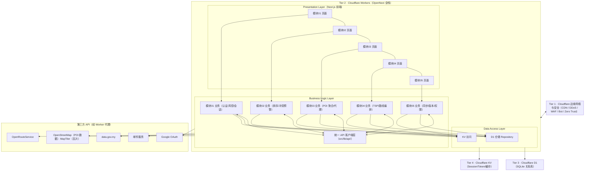

# 系统架构概览

> TravelSync — 马来西亚轻量级旅游规划网站（Next.js 16 + React 19 + Zustand + Tailwind 4，全栈部署于 Cloudflare Workers）

本架构遵循 **单一责任原则**：每一个 Tier、Layer、Component、Sub-Component 只有唯一职责，禁止责任混叠。通信遵循 **轻量渐进式解耦**：模块内部组件经 Zustand Store / React hooks / Props 直接通信，不引入 Coordinator / EventBus 等包装层；仅跨模块边界保留统一 API 客户端层（`src/lib/api/`）中转；所有持久化写入与第三方 API 调用必须经 API 客户端。

---

## 0. 总体架构风格与技术栈

| 项目 | 选型 |
|---|---|
| 架构风格 | 边缘优先的 Serverless 分层架构（前端优先，能前端实现绝不用后端） |
| 前端 | Next.js 16 (App Router) + React 19 + Zustand（状态）+ Tailwind 4 |
| 后端 | Cloudflare Workers（经 @opennextjs/cloudflare 全栈部署）；服务端逻辑写在 Next.js Route Handlers / Server Actions：认证、权限、限流、第三方 API 代理、写库 |
| 主数据库 | Cloudflare D1（关系型，SQLite 内核） |
| 键值存储 | Cloudflare KV（Session / Token / 限流 / 缓存） |
| 实时协作 | 段轮询 + 乐观并发控制（需求指定，不引入 WebSocket） |
| 第三方 API | Google OAuth、邮件服务、data.gov.my、OpenStreetMap、OpenRouteService、PDF 生成 |

**部署形态**：全栈 Next.js 16（App Router）经 **@opennextjs/cloudflare**（OpenNext 适配器，Cloudflare 官方推荐路径，next-on-pages 已弃用）部署到 **Cloudflare Workers**——单一 Worker 同时承载静态资产、RSC 服务端渲染与全部后端 API（Route Handlers / Server Actions），无需拆分独立 Functions 目录，也不启用 `output: 'export'`（静态导出会禁用 Route Handlers / Server Actions / 动态 RSC）；所有请求先经过 Cloudflare 边缘网络（CDN/WAF/Bot/Zero Trust）。

---

## 1. 第一等级：Tier（基础设施层）

> 本等级共 4 个 Tier，解决"跑在哪里、存到哪里、怎么被保护"。

| Tier | 定位 | 职责（单一） |
|---|---|---|
| **T1 Cloudflare 边缘网络与安全** | 全球分布式网络基础设施与安全盾牌 | 内容分发（CDN）、DDoS 缓解、WAF、Bot 管理、Zero Trust 访问控制；对外加速全球访问，对内替代 VPN 保护管理入口 |
| **T2 Cloudflare Workers** | 全栈 Serverless 平台（原 Pages 托管能力已并入 Workers 平台，官方 Next.js 部署路径） | 静态资产托管、Next.js 全栈运行时（RSC/SSR/Route Handlers/Server Actions）、CI/CD（Git 推送自动构建分发） |
| **T3 Cloudflare D1** | 边缘原生 Serverless 关系型数据库 | 结构化业务数据的 SQL 持久化（用户、行程、收藏、路线、协作等） |
| **T4 Cloudflare KV** | 全球分布式键值数据库 | 读多写少的临时/高频数据：Session Token、邀请 Token、限流计数、第三方 API 响应缓存（最终一致性，仅限无强一致需求的场景；轮询游标等写后即读数据归 D1） |

### Tier 之间的交流

| 交流方向 | 方式 | 内容 |
|---|---|---|
| T1 ↔ T2 | HTTP（边缘路由） | 用户请求先经 T1 过滤（WAF/Bot/限速/CDN 缓存命中）再进入 T2；T2 的响应经 T1 加速回传 |
| T2 → T3 | D1 HTTP API / SQL Binding | Worker（Route Handler）执行业务 SQL（增删改查、事务） |
| T2 → T4 | KV Binding（`env.KV`） | Worker 读写 Session、Token、限流计数、缓存；前端不直接接触 KV |
| T2 ↔ 第三方 API | 出站 HTTPS（Route Handler 代理） | Worker 侧代收代发第三方请求（保护密钥、统一缓存），前端永不直连 |
| T3 / T4 之间 | 不直接交流 | 两者均为 T2 的数据后端，由 T2 编排，避免存储层相互耦合 |

---

## 2. 第二等级：Layer（逻辑分层）

> 本等级共 3 个 Layer，叠加在 T2（Pages）之上，横切全部 5 个业务模块。

| Layer | 职责（单一） | 载体 |
|---|---|---|
| **Presentation Layer** | 纯 UI：页面、组件、表单、地图交互、客户端状态（Zustand）；不含业务规则 | 前端（浏览器） |
| **Business Logic Layer** | 业务规则与流程编排：校验、限流、排序算法、冲突解决、版本、权限判定、第三方 API 编排；不直接碰存储，也不渲染 UI | 前端（可前端完成的逻辑）+ Worker（Route Handlers / Server Actions，必须服务端的逻辑） |
| **Data Access Layer** | 数据读写封装：D1 SQL 仓储（Repository/DAO）与 KV 键值访问；不包含业务判断 | Worker（Route Handlers 内部服务） |

### Layer 之间的交流

```
Presentation Layer ──调用──▶ Business Logic Layer ──调用──▶ Data Access Layer ──读写──▶ D1 / KV
        │                        │                              │
        └────────────── 事件/状态流（前端内部）◀────────────────┘
```

| 交流方向 | 方式 | 内容 |
|---|---|---|
| Presentation → Business Logic | 前端函数调用 / Route Handlers REST 调用 | UI 事件触发业务动作（如"登录"→ 编排校验→签发会话） |
| Business Logic → Data Access | 仓储/DAO 方法调用（服务端内部） | 只传领域对象与查询参数，不传 SQL 之外的具体实现细节 |
| Data Access → D1 / KV | SQL / KV Binding | 唯一允许触碰存储的层 |
| Business Logic → 第三方 API | Route Handlers 出站 HTTPS（经代理） | Google OAuth、邮件、data.gov.my、OSM、ORS |
| Presentation ← Business Logic | 响应数据 / 推送状态 | 结果回填 UI（Zustand store 更新） |

**单向依赖铁律**：上层可依赖下层，下层绝不可反向依赖上层；Presentation 不直连 Data Access（一切经 Business Logic 的 API 客户端）。

---

## 3. 第三等级：Component（按模块拆分）

> 本等级共 **5 个模块、35 个 Component + 1 个跨切面 API 客户端层**。每个模块内部由"业务 Component + 数据访问 Component"构成；模块内部经 Zustand Store / hooks 直接通信，跨模块交流统一经 **API 客户端层**（`src/lib/api/`）中转，业务 Component 之间禁止跨模块直连。

### 模块 01：用户与账户（6 个 Component）

| 组件 | 所属 Layer | 职责（单一） | 存储 | 第三方 API |
|---|---|---|---|---|
| C1-1 身份认证与登录 | Presentation + Business Logic | 邮箱密码登录、Google 登录、登录前置校验 | KV `oauth_state:*`、D1 `users`（读） | **Google OAuth** |
| C1-2 账号安全与风控 | Business Logic | 单 IP 限流（10 次/分）、账号状态判定、精准错误码 | KV `rate_limit:{ip}`、D1 `users`（状态） | 无 |
| C1-3 会话管理 | Business Logic + Data Access | Session Token 生成/校验/销毁（记住我≤31 天） | KV `session:{token}` | 无 |
| C1-4 注册与密码找回 | Presentation + Business Logic | 注册、邮箱验证、忘记密码重置全流程 | D1 `users`（写）、KV `password_reset:*` | **邮件服务** |
| C1-5 账户日志 | Data Access | 最后登录时间更新、登录审计 | D1 `users.last_login_at`、`login_logs` | 无 |
| C1-6 密码安全（横切） | Business Logic | 密码哈希/比对（bcrypt/argon2） | 无 | 无（本地库） |

### 模块 02：行程与路线规划（5 个 Component）

| 组件 | 所属 Layer | 职责（单一） | 存储 | 第三方 API |
|---|---|---|---|---|
| C2-1 行程管理 | Presentation | 行程 CRUD 页面与表单（最远 1 年校验） | 无 | 无 |
| C2-2 行程明细管理 | Presentation | 明细项（景点/餐厅/住宿等）CRUD 与备注 | 无 | 无 |
| C2-3 行程组织与分类 | Presentation | 拖拽排序、类型标记（纯前端） | 无 | 无 |
| C2-4 智能行程辅助 | Business Logic | 耗时估算编排、时间冲突预警（前端计算） | 无 | 经模块 04 间接使用 **OpenRouteService** |
| C2-5 行程数据访问 | Data Access | 行程/明细/分类表 SQL 仓储 + KV 缓存 | D1 `trip`、`itinerary_item`、`item_category` | 无 |

### 模块 03：目的地探索与灵感推荐（8 个 Component）

| 组件 | 所属 Layer | 职责（单一） | 存储 | 第三方 API |
|---|---|---|---|---|
| C3-1 POI 搜索与筛选 | Presentation | 关键词 + 多维筛选（类型/认证/文化/穆斯林友好/室内外）UI | 无 | 无 |
| C3-2 灵感合辑与节日推荐 | Presentation | 主题合辑、按出行时间推荐节日赛事及周边联动 | 无 | **data.gov.my**（经代理） |
| C3-3 POI 详情决策卡片 | Presentation | 详情展示、品质徽章、设施排雷 | 无 | **data.gov.my**（经代理） |
| C3-4 收藏与备选池管理 | Presentation | 收藏文件夹 CRUD、Bucket List、一键批量推送行程 | D1 `favorite_folder`、`favorite_item`、`bucket_list` | 无 |
| C3-5 地点数据服务 | Business Logic | 聚合 POI 实体（基础信息+徽章+设施+坐标） | D1 `poi_cache` | **data.gov.my**（经代理） |
| C3-6 第三方 API 代理 | Business Logic | 代理 data.gov.my / OSM，保护密钥、统一缓存 | KV `dgm:*`、`osm:poi_search:*` | **data.gov.my**、**OpenStreetMap** |
| C3-7 D1 数据访问 | Data Access | 收藏/备选池/地点缓存 SQL 仓储 | 上述 D1 表 | 无 |
| C3-8 KV 缓存 | Data Access | 第三方响应缓存读写 | 上述 KV key | 无 |

### 模块 04：物流与地图路线规划（9 个 Component）

| 组件 | 所属 Layer | 职责（单一） | 存储 | 第三方 API |
|---|---|---|---|---|
| C4-1 交互地图引擎 | Presentation | 平移缩放、多图层切换（标准/卫星/路况）、点击拾取坐标 | 无 | **MapTiler**（瓦片，浏览器直连 + 域名白名单） |
| C4-2 地点检索选择 | Presentation | 关键字检索 POI 并添加为起/终/途径点 | 无 | **OpenRouteService**（地理编码） |
| C4-3 路线计算引擎 | Business Logic | 多出行方式路线计算、点对点耗时/距离矩阵（N×N）、方案对比、距离/ETA/成本 | 无 | **OpenRouteService**（经代理） |
| C4-4 路线生成与详情展示 | Presentation | 轨迹绘制、概览、停靠点列表、分段详情 | 无 | 无（复用模块 03 地图） |
| C4-5 智能路线优化 | Business Logic | 基于 ORS 真实耗时矩阵的前端 TSP 多策略重排、优化前后对比 | KV `route-result:*`（矩阵缓存） | **OpenRouteService**（matrix，经代理） |
| C4-6 路线生命周期管理 | Business Logic | 路线保存/唤醒/二次计算/删除的业务规则 | 无 | 无 |
| C4-7 路线管理界面 | Presentation | 已存路线列表、详情、增删途径点 | 无 | 无 |
| C4-8 路线数据访问 | Data Access | 路线与停靠点表 SQL 仓储 | D1 `routes`、`route_stops` | 无 |
| C4-9 缓存访问 | Data Access | 路线计算结果 KV 缓存 | KV `route-result:*` | 无 |

### 模块 05：协同合作（7 个 Component）

| 组件 | 所属 Layer | 职责（单一） | 存储 | 第三方 API |
|---|---|---|---|---|
| C5-1 成员与团队管理 | Business Logic + Presentation | 邀请/接受/拒绝、30 天 Token 过期、退出/移除、成员列表 | D1 `collab_members`、KV `invite:{token}` | **邮件服务** |
| C5-2 角色与权限 | Business Logic | Editor/Viewer 角色分配与前后端双层权限校验 | D1 `collab_roles` | 无 |
| C5-3 实时协同与同步 | Business Logic | 段轮询、乐观更新、冲突解决、离线编辑队列、变更提交/轮询端点 | D1 `trip_versions`（变更增量，D1 默认强一致，写后读一致） | 无 |
| C5-4 导入导出与分享 | Business Logic | PDF 导出（前端生成）、文件导入、只读分享链接 | KV `share:{token}` | 无（前端库 **@react-pdf/renderer**） |
| C5-5 版本控制 | Business Logic | 版本快照、历史查询、授权回滚 | D1 `trip_versions` | 无 |
| C5-6 动态日志与通知 | Business Logic + Presentation | 活动动态时间线、重大变更通知、通知历史 | D1 `activity_logs`、`notifications` | 无 |
| C5-7 即时通讯与分享 | Business Logic | 群聊消息、私房景点/餐厅分享卡片 | D1 `chat_messages`（消息增量拉取） | 无 |

### 跨切面组件：统一 API 客户端层

| 组件 | 所属 Layer | 职责（单一） |
|---|---|---|
| **X-1 API 客户端层**（`src/lib/api/`） | Business Logic（前端侧）+ Worker Route Handlers（服务端侧） | 原各模块"通信协调"职责收敛于此：`auth.ts`（登录/会话/用户查询）、`trip.ts`（行程/明细 CRUD）、`discovery.ts`（POI 搜索/收藏/备选池）、`route.ts`（路线/耗时/矩阵）、`collab.ts`（邀请/权限/变更提交/轮询/消息）；前端侧统一鉴权头、错误处理、重试，服务端侧承载第三方 API 代理端点与变更提交编排（落库→版本快照→动态日志） |

### Component 之间的交流

**交流总原则**：同模块 Component 之间通过 Zustand Store / React hooks / Props 直接通信（禁止 Coordinator / EventBus 包装层）；跨模块 Component 之间经统一 API 客户端（`src/lib/api/`）与轻量跨模块事件（如地图定位 `mapFocus`）中转，数据流仍遵循 Presentation → Business Logic → Data Access 单向依赖。

| 交流方向 | 中转者 | 内容 |
|---|---|---|
| C1-1~C1-5 之间 | 服务端 Route Handler 内顺序编排（`/api/auth/login`），前端经 `auth.ts` 调用 | 登录链路：限流→状态校验→凭据比对→签发会话→写日志 |
| C2-1~C2-4 → C2-5 | Zustand Store（行程/明细/组织/辅助共享）→ `src/lib/api/trip.ts` | 行程/明细 CRUD 持久化（唯一写库通道） |
| C2-3 → C2-2 / C2-5 | 行程 Store 更新 sort_order + `trip.ts` 批量持久化 | 新排序、类型变更 |
| C2-4 ↔ C2-3 | Store 订阅（行程顺序变化自动触发重估） | 顺序变更触发重估、耗时结果回填 |
| C3-1~C3-4 | 探索 Store（搜索/收藏/备选池共享状态） | 搜索结果→收藏/暂存、收藏标记回填、详情联动 |
| C3-1~C3-4 → C3-5/C3-6 | `src/lib/api/discovery.ts`（search/detail/event/favorite） | 搜索、详情、节日数据请求 |
| C4-1 → C4-2 | 路线规划 Store | 拾取坐标/POI 转停靠点 |
| C4-2 → C4-3 → C4-4 | Store 订阅 + `src/lib/api/route.ts` | 停靠点增删触发重算、结果推送渲染 |
| C4-5 → C4-3/C4-4 | Store 订阅 | 优化后顺序应用与前后对比 |
| C4-6 → C4-8/C4-3 | `src/lib/api/route.ts` + Store | 保存/唤醒路线、二次计算 |
| C5-1~C5-7 | 协作 Store（Zustand）+ 服务端变更提交端点内编排 | 成员变更→权限刷新、冲突→角色复核、回滚→强制重同步、通知→群聊提示 |

**跨模块 Component 交流（经桥，对应 docs/design/模块之间的交流.md）**：

| 模块间 | 中转 | 交流内容 |
|---|---|---|
| 模块01 ↔ 模块05 | `src/lib/api/auth.ts`（validateSession / lookupUser）供 `collab.ts` 复用 | 邀请时查询用户邮箱；权限校验时验证 Session |
| 模块02 ↔ 模块03 | `src/lib/api/discovery.ts`（getPOI / pushBucketListToItinerary）+ 轻量跨模块事件 `mapFocus` | 收藏/搜索地点导入为行程明细；明细在地图居中定位 |
| 模块02 ↔ 模块04 | `src/lib/api/route.ts`（importItineraryStops / getTravelTime / emitOptimizedOrder） | 明细项作为停靠点；回传交通耗时；优化后新顺序回写行程 Store |
| 模块02 ↔ 模块05 | `src/lib/api/collab.ts`（submitChange / pollChanges）；行程 Store 变更经乐观更新写入 | 行程变更→同步/版本/动态日志；同步回执 |
| 模块03 ↔ 模块04 | `src/lib/api/route.ts`（importCoordinates）；轨迹绘制复用模块 03 地图组件（同页组件直接传地图实例 props） | 地点坐标供给；路线轨迹复用模块 03 地图渲染 |

---

## 4. 第四等级：Sub-Component

> 每个 Component 拆解为 Sub-Component；所有对外通信（持久化写入、第三方 API、跨模块调用）统一经 API 客户端层（`src/lib/api/`），Sub-Component 不自行封装通信层。

### 模块 01 Sub-Component

**C1-1 身份认证与登录**：`LoginPage`（登录表单+前端校验）、`GoogleLoginButton`（OAuth 入口）、`LoginAction`（登录 Route Handler 编排：限流→校验→比对→签发→日志）、`CredentialVerifier`（状态校验+哈希比对）、`OAuthHandler`（授权码换 Token/建档）
**C1-2 账号安全与风控**：`LoginRateLimiter`（KV 限流）、`AccountStatusGuard`（账号状态判定）、`FailureReasonMapper`（错误码→精准提示）
**C1-3 会话管理**：`SessionIssuer`（签发 Token 写 KV）、`SessionDestroyer`（销毁）、`SessionValidator`（会话校验，供 `auth.ts` 与模块 05 复用）、`RememberMeResolver`（有效期 7/31 天）、`SessionStateStore`（前端登录态）
**C1-4 注册与密码找回**：`RegisterPage`、`RegisterAction`、`EmailVerifier`、`ForgotPasswordPage`、`ResetPasswordAction`、`ResetTokenManager`（KV 重置令牌）、`MailSender`（**邮件服务**）
**C1-5 账户日志**：`LastLoginUpdater`、`LoginAuditWriter`
**C1-6 密码安全**：`PasswordHasher`（bcrypt/argon2）

### 模块 02 Sub-Component

**C2-1 行程管理**：`TripListPage`、`TripFormDialog`、`TripDateValidator`（最远 1 年）、`TripDetailPage`、`TripStore`
**C2-2 行程明细管理**：`ItemFormDialog`、`ItemCard`、`NoteEditor`、`ItemStore`（承接模块 03 导入地点与 CRUD 持久化；地图定位经 `mapFocus` 事件）
**C2-3 行程组织与分类**：`DragDropBoard`（拖拽排序）、`TypeTagSelector`、`OrderCalculator`（新顺序写入行程 Store 并批量持久化）
**C2-4 智能行程辅助**：`TravelTimeEstimator`（耗时估算编排）、`ConflictDetector`（冲突预警，前端计算）、`DurationBadge`、`WarningBanner`、`AssistanceStore`（订阅行程顺序变化）
**C2-5 行程数据访问**：`TripRepository`、`ItemRepository`（含 sort_order 批量更新）、`CategoryRepository`、`CacheManager`（KV）、`ServerValidator`（服务端二次校验，Route Handler 内执行）

### 模块 03 Sub-Component

**C3-1 POI 搜索与筛选**：`SearchBar`、`FilterPanel`、`SearchResultsList`、`SearchStateStore`
**C3-2 灵感合辑与节日推荐**：`CollectionsGallery`、`EventDiscoveryPanel`、`NearbySuggestion`
**C3-3 POI 详情决策卡片**：`POIDetailCard`、`QualityBadge`、`FacilityChecklist`
**C3-4 收藏与备选池管理**：`FolderManager`、`FavoriteActions`、`BucketListPanel`、`BulkPushToItinerary`（一键推送模块 02）
**C3-5 地点数据服务**：`POIAggregator`（聚合实体）、`GeoCoordinateProvider`（坐标→模块 04）、`POIProvider`（实体→模块 02）
**C3-6 第三方 API 代理**：`DataGovProxy`（data.gov.my 代理）、`OsmProxy`（OSM 代理）
**C3-7 D1 数据访问**：`FavoriteFolderRepo`、`FavoriteItemRepo`、`BucketListRepo`、`PoiCacheRepo`
**C3-8 KV 缓存**：`ThirdPartyCacheService`（dgm:*）、`POISearchCacheService`（osm:poi_search:*）

### 模块 04 Sub-Component

**C4-1 交互地图引擎**：`MapViewportController`、`LayerSwitcher`（标准/卫星/路况）、`MapClickPicker`（拾取坐标）
**C4-2 地点检索选择**：`GeocodeSearchBar`、`PlaceAddAction`、`LocationNormalizer`（坐标归一）
**C4-3 路线计算引擎**：`RouteRequestBuilder`（组装 ORS 请求）、`RouteCompareEngine`（多方案对比）、`TrafficCostAnalyzer`（路况/限行/费用）
**C4-4 路线生成与详情展示**：`RoutePolylineRenderer`（复用模块 03 地图）、`RouteOverviewPanel`、`StopListPanel`、`SegmentDetailViewer`
**C4-5 智能路线优化**：`MatrixFetcher`（批量拉取 N×N 真实耗时矩阵，经 ORS 代理 + KV 缓存）、`TspEngine`（基于真实耗时矩阵的 TSP 重排核心）、`StrategySelector`（最快/最短/避开拥堵收费）、`BeforeAfterCompare`、`OrderApplyAction`（新顺序应用）
**C4-6 路线生命周期管理**：`RouteSnapshotService`、`RouteWakeUpService`、`RouteValidationService`
**C4-7 路线管理界面**：`SavedRouteList`、`RouteDetailView`、`RouteDeleteAction`
**C4-8 路线数据访问**：`RouteTableAccess`（D1 `routes`）、`StopTableAccess`（D1 `route_stops`）
**C4-9 缓存访问**：`RouteResultCache`（route-result:*）

### 模块 05 Sub-Component

**C5-1 成员与团队管理**：`成员管理面板 UI`、`我的协作行程页 UI`、`邀请接受/拒绝页 UI`、`成员状态 Store`、`邀请发起服务`、`邀请 Token 生命周期管理`（30 天过期）、`成员增删服务`、`成员 DAO`、`邀请 Token KV 访问`
**C5-2 角色与权限**：`角色管理 UI`、`权限上下文 Store`、`角色分配服务`、`服务端权限校验器`、`前端权限守卫`、`角色权限 DAO`
**C5-3 实时协同与同步**：`在线协作状态 UI`、`段轮询客户端`、`乐观更新引擎`、`冲突解决器`（前端）、`离线编辑队列`（本地存储重放）、`变更合并器`、`轮询端点`（D1 增量查询 `WHERE id > cursor`，游标由客户端持有，不存 KV）、`变更提交端点`、`变更增量 DAO`
**C5-4 导入导出与分享**：`导出面板 UI`、`导入面板 UI`、`PDF 生成器`（前端 @react-pdf/renderer，浏览器端导出，不占用 Serverless 资源）、`导入解析器`、`分享链接服务`、`分享 Token KV 访问`
**C5-5 版本控制**：`版本历史面板 UI`、`回滚确认 UI`、`版本快照生成器`、`版本查询服务`、`回滚服务`、`版本记录 DAO`
**C5-6 动态日志与通知**：`活动动态 Feed UI`、`通知中心 UI`、`Feed 与通知 Store`、`动态日志记录器`、`通知触发器`、`通知服务`、`动态日志 DAO`、`通知 DAO`
**C5-7 即时通讯与分享**：`群聊面板 UI`、`景点/餐厅分享卡片 UI`、`消息 Store`、`消息乐观发送队列`、`消息发送服务`、`消息拉取服务`（按 `id > cursor` 增量拉取，游标由客户端持有）、`消息 DAO`

### Sub-Component 之间的交流（典型链路）

| 链路 | 途经路径 | 内容 |
|---|---|---|
| 登录链路 | `LoginPage` → `src/lib/api/auth.ts` → `/api/auth/login`（Route Handler 内编排 `LoginRateLimiter`/`CredentialVerifier`/`SessionIssuer`/`LastLoginUpdater`） | 限流→校验→比对→签发→日志 |
| 写行程链路 | `TripFormDialog` → `tripStore.save()` → `src/lib/api/trip.ts` → Route Handler → `TripRepository` → D1 | 任何行程写入的唯一路径 |
| 地图定位链路 | `ItemCard`（定位按钮）→ 轻量跨模块事件 `mapFocus` → 模块 03 地图组件 | 明细项在地图上居中定位 |
| 耗时估算链路 | `TravelTimeEstimator` → `src/lib/api/route.ts`（getTravelTime / matrix）→ ORS 代理（Route Handler）→ `TrafficCostAnalyzer` → 回填 `AssistanceStore` | 停靠点→真实耗时→冲突预警 |
| 协作同步链路 | `ItemStore` 变更 → 乐观更新 → `src/lib/api/collab.ts`（submitChange）→ 变更提交端点（编排版本快照 + 动态日志）→ 协作者段轮询 `pollChanges` 拉取 | 变更→版本+动态日志→轮询分发 |
| 备选池推送链路 | `BucketListPanel` → `BulkPushToItinerary` → `src/lib/api/discovery.ts`（pushBucketListToItinerary）→ 行程导入端点 → `tripStore` 刷新 | 一键批量导入行程明细 |

---

## 5. 备注：第三方 API 与数据库标注

### 第三方 API（全部经 Worker 侧 Route Handlers 代理，前端不直连）

| API | 消费模块 | 用途 |
|---|---|---|
| **Google OAuth** | 模块 01 | Google 邮箱第三方登录 |
| **邮件服务（SMTP 类）** | 模块 01、05 | 验证邮件、密码重置邮件、协作邀请邮件 |
| **data.gov.my** | 模块 03 | 官方品质认证/评级徽章、官方节日与赛事数据 |
| **OpenStreetMap** | 模块 03 | POI 地理数据（经代理查询） |
| **MapTiler** | 模块 04 | 地图瓦片/图层渲染（浏览器直连 + 域名白名单，靠浏览器 HTTP 缓存，不经后端代理） |
| **OpenRouteService** | 模块 04（经模块 04 间接服务模块 02） | 实时路线计算：距离、ETA、多出行方式、路况/费用；点对点耗时矩阵（`/v2/matrix`，免费层上限 3500 locations/请求） |
| ~~PDF 生成~~（已从第三方 API 表移除） | — | 行程打印版 PDF 由前端 **@react-pdf/renderer** 在浏览器端生成（Worker 边缘环境无 Chromium/child_process，无法运行 Puppeteer 类服务端方案；前端生成符合"前端优先"原则） |

### 数据库

**Cloudflare D1（关系型主库，16 张表）**：

| 模块 | 表 |
|---|---|
| 01 | `users`、`login_logs` |
| 02 | `trip`、`itinerary_item`、`item_category` |
| 03 | `favorite_folder`、`favorite_item`、`bucket_list`、`poi_cache` |
| 04 | `routes`、`route_stops` |
| 05 | `collab_members`、`collab_roles`、`trip_versions`、`activity_logs`、`notifications`、`chat_messages` |

**Cloudflare KV（键值缓存/临时态）**：`session:{token}`、`oauth_state:{state}`、`password_reset:{token}`、`rate_limit:{ip}`、`invite:{token}`、`share:{token}`、`dgm:*`（data.gov.my 缓存）、`osm:poi_search:*`、`route-result:*`（路线/矩阵计算结果缓存）

> 表结构与字段定义详见 `docs/design/数据库设计.md`，接口端点详见 `docs/design/API接口设计.md`，模块间数据流说明详见 `docs/design/模块之间的交流.md`。

---

## 6. 架构总览图


